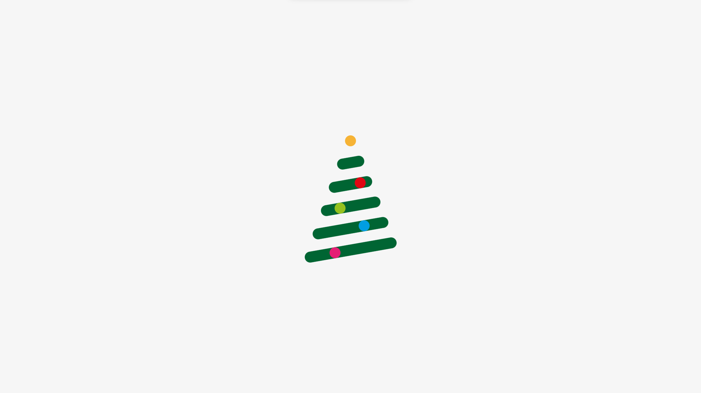
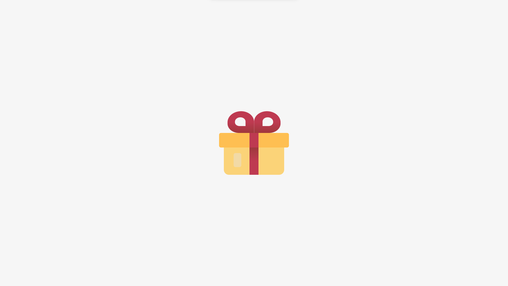

<h1 align="center"> 30 Days of CSS: Xmas Edition </h1>

As a practice, this challenge is to create a CSS project every day during 30 days - being it a simple project or a more complex one. Since I started it on December 1st, the main theme for inspiration is Christmas 🎄.

## Day 01

A minimalist Christmas tree with some CSS animations. The original design was made by [Rubén Ferlo](https://dribbble.com/shots/2424958-Merry-Christmas?1451131880). Go check it! 🎄

## Day 02

A simple CSS Art of a Christmas Gift. 🎁
